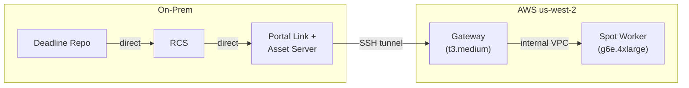

# Configuring Deadline AWS Portal

## Architecture (Path A — Full AWS Portal)

AWS Portal provides auto-scaling Spot workers with built-in networking (Gateway + SSH tunnel) and file sync (Asset Server). On-prem workers are unaffected — they continue connecting to the repo directly.



**Cloud worker → repo path:** Worker → Gateway (VPC) → SSH tunnel → Portal Link → RCS → Repo
**On-prem worker → repo path:** Worker → Repo (unchanged)

ZeroTier is NOT needed for Portal-managed workers. The Gateway handles connectivity. ZeroTier remains available as a fallback for manually launched workers (CLI scripts).

## Status — AWS Portal Server

The AWS Portal Server (Link + Asset Server) is installed on the Windows Deadline Repository machine. It is distributed as a **separate installer** (`AWSPortalLink-10.4.2.3-windows-installer.exe`) included in the Deadline download archive from the AWS Console → Thinkbox products page. It is NOT a Monitor plugin.

## Prerequisites
- AMI `ami-0f70342f66dc80ddb` is validated and available in us-west-2
- Quota increase for G/VT Spot in us-west-2 is approved (160 vCPUs)
- AWS Portal Server (Link + Asset Server) installed on Windows repo machine
- Deadline Client with RCS installed on same machine
- AWSPortal IAM user created with `AWSThinkboxAWSPortalAdminPolicy` + `AWSThinkboxDeadlineResourceTrackerAdminPolicy`

## First-Time Setup (GUI — one-time)

1. **Start RCS** on the Windows machine
2. **Log in to AWS Portal** — Deadline Monitor → View → New Panel → AWS Portal → enter AWSPortal IAM credentials
3. **Start Infrastructure** — right-click in AWS Portal panel → Start Infrastructure → select us-west-2. This launches the Gateway EC2 instance.
4. **Start Spot Fleet** — right-click Infrastructure → Start Spot Fleet:
   - Check **Use AMI ID** → paste `ami-0f70342f66dc80ddb`
   - Target Capacity: 1 (for testing)
   - Instance Type: g6e.4xlarge
   - Pool: houdini-aws-gpu
   - Auto Shutdown: 15 min idle
   - Launch
5. Worker appears in Deadline Monitor within a few minutes

After first-time setup, use `aws/portal_infra.sh` to manage Infrastructure lifecycle from the CLI.

## Asset Server Root Directories

Current test configuration:
- `D:\` (test — all renders sync here)

Production: add QNAP UNC paths (e.g. `\\QNAS\renders\`) as root directories.
Can be changed later in Deadline Monitor: Tools → Configure Asset Server.

## Path Mapping

Configure Deadline path mapping so the worker's Linux output path maps to a Windows path under an Asset Server root.

In Deadline Monitor: **Tools → Configure Repository → Path Mapping**

| Windows path (Asset Server) | Linux path (EC2 worker) |
|---|---|
| `D:\renders\` | `/mnt/renders/` |

When Houdini writes to `/mnt/renders/project/shot/`, the Asset Server syncs output to `D:\renders\project\shot\`.

## Operator Workflow

1. Start Infrastructure (`./aws/portal_infra.sh start` or via Monitor)
2. Wait for Gateway to show Running in AWS Portal panel
3. Start Spot Fleet if not auto-scaled (right-click Infrastructure → Start Spot Fleet)
4. Submit Houdini job to pool `houdini-aws-gpu`
5. Worker picks up job, Asset Server syncs scene file to worker
6. Render completes, Asset Server syncs EXR output back to on-prem
7. Worker idle 15 min → Portal auto-terminates
8. Stop Infrastructure when done (`./aws/portal_infra.sh stop` or via Monitor)

## Cost

| Component | Approx cost/hr |
|---|---|
| Gateway (t3.medium) | ~$0.05 |
| Worker (g6e.4xlarge Spot) | ~$0.50–2.00 |
| S3 cache (asset transfer) | per-GB |

**Always stop the Infrastructure when not rendering** to kill the Gateway charge.

## CLI Fallback: Manual Spot Worker Management

If Portal is unavailable or for quick one-off workers, use the CLI scripts:

```bash
source .env

# Launch one worker (default)
./aws/launch_spot_worker.sh

# Launch three workers
./aws/launch_spot_worker.sh 3
```

After launch, authorize each new ZeroTier node at:
https://my.zerotier.com/network/d3ecf5726d14ac76

```bash
# List running workers
./aws/terminate_spot_worker.sh --list

# Terminate a specific instance
./aws/terminate_spot_worker.sh i-0abc123def456

# Terminate all project workers
./aws/terminate_spot_worker.sh --all
```

CLI workers use ZeroTier for repo connectivity and rclone/B2 for render output. They are NOT managed by the Portal.
