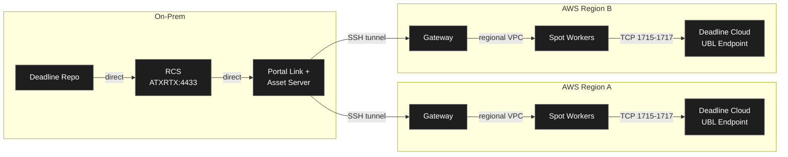

# Configuring Deadline AWS Portal

## Architecture: multi-region Portal capacity with central Deadline/RCS

AWS Portal provides auto-scaling Spot workers with built-in networking through a regional Gateway and on-prem Portal Link/Asset Server. On-prem workers remain unchanged and continue connecting to the repository directly.



**Portal worker → repo path:** Worker → regional Gateway → SSH tunnel → Portal Link → RCS → Repo.

**On-prem worker → repo path:** Worker → Repo/RCS directly.

ZeroTier is not required for Portal-managed workers. ZeroTier remains available for manually launched fallback workers from the CLI scripts.

## Multi-region requirements

For every AWS region where workers may be sourced, prepare all of the following:

- A Portal infrastructure stack started from Deadline Monitor.
- A Gateway in that region, created by AWS Portal.
- A worker AMI copied to or built in that region.
- G/VT Spot quota and instance-family availability for the chosen GPU type.
- A Deadline Cloud license endpoint in the same region/VPC as the workers.
- Metered products attached to the regional endpoint: `houdini-21.0`, `karma-21.0`, and `mantra-21.0`.
- A regional Secrets Manager value containing the endpoint DNS. Default secret name: `houdini/license-endpoint-dns`.
- Security groups that allow worker access to the regional UBL endpoint on TCP `1715-1717` and allow Portal-managed worker traffic required by the Gateway.

Deadline Repository/RCS does not need to be duplicated per region.

## AWS Portal Server status

The AWS Portal Server (Link + Asset Server) is installed on the Windows Deadline Repository machine. It is distributed as a separate installer (`AWSPortalLink-10.4.2.3-windows-installer.exe`) included in the Deadline download archive from the AWS Console → Thinkbox products page. It is not just a Monitor plugin.

## Prerequisites

- Validated worker AMI is available in every target worker region.
- AWS Portal Server (Link + Asset Server) installed on the Windows repo machine.
- Deadline Client with RCS installed on the same machine.
- AWSPortal IAM user created with `AWSThinkboxAWSPortalAdminPolicy` and `AWSThinkboxDeadlineResourceTrackerAdminPolicy`.
- Regional Deadline Cloud UBL endpoints exist before launching Houdini workers.

## First-time setup per region through Deadline Monitor

1. Start RCS on the Windows machine.
2. Open Deadline Monitor.
3. Enable Tools → Power User Mode.
4. Open View → New Panels → AWS Portal.
5. Log in with the AWSPortal IAM credentials.
6. Right-click in the AWS Portal panel → Start Infrastructure.
7. Select the worker region, for example `us-west-2`, `us-east-1`, or `eu-west-1`.
8. After the regional Gateway is running, right-click Infrastructure → Start Spot Fleet:
   - Check Use AMI ID and paste the AMI ID copied into that same region.
   - Target Capacity: 1 for testing.
   - Instance Type: choose the available GPU type in that region.
   - Pool: `houdini-aws-gpu`.
   - Auto Shutdown: 15 minutes idle.
   - Launch.
9. Repeat for each region that may provide capacity.
10. Worker appears in Deadline Monitor within a few minutes.

After first-time setup, use `aws/portal_infra.sh --region <REGION> status` and `aws/portal_infra.sh --region <REGION> stop` to inspect or stop regional Portal resources from the CLI. Starting infrastructure still happens through Deadline Monitor.

## Asset Server root directories

Current test configuration:

- `D:\` (test — all renders sync here)

Production: add QNAP UNC paths such as `\\QNAS\renders\` as root directories. This can be changed later in Deadline Monitor: Tools → Configure Asset Server.

## Path mapping

Configure Deadline path mapping so the worker's Linux output path maps to a Windows path under an Asset Server root.

In Deadline Monitor: Tools → Configure Repository → Path Mapping.

| Windows path (Asset Server) | Linux path (EC2 worker) |
|---|---|
| `D:\renders\` | `/mnt/renders/` |

When Houdini writes to `/mnt/renders/project/shot/`, the Asset Server syncs output to `D:\renders\project\shot\`.

## Operator workflow

1. Choose candidate worker regions based on GPU Spot availability and quota.
2. Start Portal infrastructure in each selected region.
3. Confirm each selected region has a matching AMI and Deadline Cloud UBL endpoint secret.
4. Start regional Spot Fleets in AWS Portal.
5. Submit Houdini jobs to pool `houdini-aws-gpu`.
6. Portal workers render and Asset Server syncs scene/output data.
7. Workers idle out through Portal auto-shutdown.
8. Stop unused regional infrastructure with `aws/portal_infra.sh --region <REGION> stop`.

## CLI fallback: manual Spot Worker management

If Portal is unavailable or for one-off direct validation, use the ready worker launcher. It configures ZeroTier, RCS certificates, and regional UBL defaults over SSM after launch.

```bash
source .env
READY_WORKER_REGIONS=us-west-2,us-east-1 ./aws/launch_ready_spot_worker.sh
```

For each fallback region, configure region-specific variables as needed:

```bash
AMI_ID_US_EAST_1=ami-...
SUBNET_ID_US_EAST_1=subnet-...
SG_ID_US_EAST_1=sg-...
HOUDINI_LICENSE_ENDPOINT_SECRET_ID_US_EAST_1=houdini/license-endpoint-dns
```

Terminate manual fallback workers in the selected region:

```bash
./aws/terminate_spot_worker.sh --region us-east-1 --list
./aws/terminate_spot_worker.sh --region us-east-1 i-0abc123def456
./aws/terminate_spot_worker.sh --region us-east-1 --all
```

Manual CLI workers use ZeroTier for repo connectivity and rclone/B2 for render output. They are not managed by AWS Portal.

## Cost reminder

Each active region has its own Gateway cost plus any worker Spot costs. Always stop unused regional infrastructure when not rendering.
