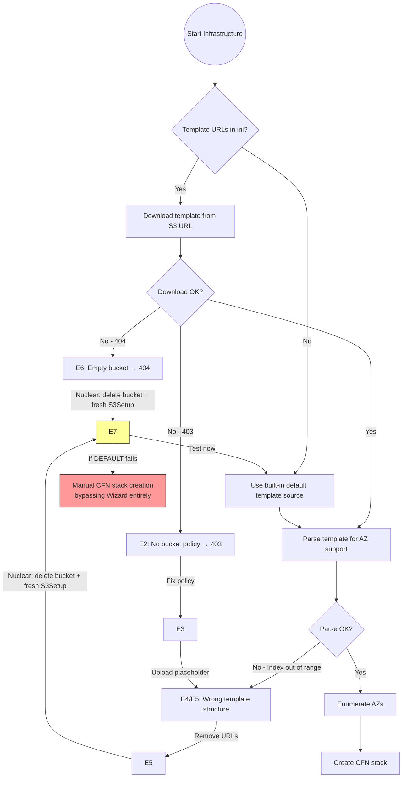

# Deadline 10 AWS Portal — Experiment Log & Decision Tree

## Goal
Get Deadline 10 AWS Portal + UBL licensing working for Houdini/Karma renders

## Known Facts
- `RunAWSPortalS3Setup` creates bucket + IAM roles + writes URLs to RCS ini
- `RunAWSPortalS3Setup` does NOT upload templates to bucket (bucket is always empty after)
- Monitor downloads "custom" template from URL in ini before showing AZ dialog
- If no template URL in ini → Monitor uses built-in default (Thinkbox-hosted)
- Wizard generates CFN from template, creates stacks, then uploads modified templates back
- Old working bucket + templates + CFN stack all deleted — no recovery possible
- Monitor log: `"Using a custom ReverseDash.template"` = downloading from S3 URL
- All errors are client-side in Monitor process (RCS log shows zero infrastructure entries)
- Bucket UUID changes each time `RunAWSPortalS3Setup` runs fresh

## Bucket History
| # | UUID | Status |
|---|------|--------|
| 1 | `5e77a4fe-5e27-4ea9-83e8-8c330a2bc590` | Deleted (old, pre-session) |
| 2 | `125caa02dd0c49dcb25c` | Deleted (nuke step) |
| 3 | `e343e3b0-2796-4669-80b2-94e2bda8e483` | Deleted (nuke step) |
| 4 | `a525143e-26ef-4395-9b99-e92c4f97cd95` | Deleted (to force fresh RunAWSPortalS3Setup) |
| 5 | `3f106c19-4d46-40f2-a65e-fdbe902ea2f7` | **CURRENT** — created by fresh RunAWSPortalS3Setup |

---

## Experiment Log

### E1: Original state — AZ error
- **Setup**: Old bucket `125caa02`, ini URLs pointed to it
- **Action**: Start Infrastructure in Monitor
- **Error**: Failed to load availability zones
- **Diagnosis**: Bucket `125caa02` was deleted, ini URLs pointed to dead bucket
- **Fix attempt**: Updated ini URLs to current bucket

### E2: Updated ini URLs — 403 Forbidden
- **Setup**: Ini URLs pointed to bucket `a525143e`
- **Action**: Start Infrastructure
- **Error**: `The remote server returned an error: (403) Forbidden`
- **Diagnosis**: Bucket had no policy, objects not public-readable
- **Fix attempt**: Added bucket policy + public-read ACL + disabled BlockPublicAccess

### E3: Bucket policy fixed — "Failed to create an infrastructure"
- **Setup**: Bucket `a525143e` with policy, empty (no templates)
- **Action**: Uploaded minimal placeholder CFN templates → Start Infrastructure
- **Error**: `Failed to create an infrastructure.`
- **Diagnosis**: Placeholder templates too minimal
- **Fix attempt**: Built larger template with 25 resources matching wiki

### E4: Larger template — "Index was out of range"
- **Setup**: Bucket `a525143e` with 8.8KB ReverseDash.template (25 resources)
- **Action**: Start Infrastructure
- **Error**: `Index was out of range. Must be non-negative and less than the size of the collection. (Parameter 'index')`
- **Diagnosis**: Monitor .NET code accesses template resources by index — my template doesn't match exact structure
- **Stack trace**: `DashChooseSolutionForm.py line 194 fillAvailableAvailabilityZones → br..ctor → AWSUtils.AvailabilityZonesSupportingGatewayInstanceType`
- **Fix attempt**: Removed template URLs from Monitor ini to force built-in default

### E5: URLs removed from Monitor ini — still "Index out of range"
- **Setup**: Monitor ini has no template URLs, RCS ini still has them
- **Action**: Start Infrastructure (no Monitor restart)
- **Error**: Same "Index was out of range"
- **Diagnosis**: Monitor reads template URLs from RCS via API, not local ini
- **Fix attempt**: None — moved to nuclear approach

### E6: Re-ran RunAWSPortalS3Setup on existing bucket — 404
- **Setup**: Bucket `a525143e` empty, ran RunAWSPortalS3Setup (found existing bucket, did nothing)
- **Action**: Start Infrastructure
- **Monitor log**: `"Using a custom ReverseDash.template from https://...a525143e.../Release/ReverseDash.template"` → `System.Net.WebException: (404) Not Found`
- **Stack trace**: Full traceback — `DashChooseSolutionForm.py:194 → fillAvailableAvailabilityZones → br.a(String) → br..ctor → AWSUtils.AvailabilityZonesSupportingGatewayInstanceType`
- **Diagnosis**: Confirmed — Monitor downloads template from S3 URL first to enumerate AZs. Empty bucket = 404.
- **Fix attempt**: Delete bucket entirely, re-run RunAWSPortalS3Setup to get fresh bucket

### E7: Fresh bucket from RunAWSPortalS3Setup — URLs still stale (CURRENT)
- **Setup**: 
  - Deleted bucket `a525143e`
  - Ran RunAWSPortalS3Setup → created new bucket `3f106c19`
  - New bucket is empty (RunAWSPortalS3Setup doesn't upload templates)
  - RCS ini still pointed to old `a525143e` (stale URLs)
  - Fixed: Updated RCS ini bucket name to `3f106c19` AND removed all 3 template URL lines
  - Restarted RCS
- **Hypothesis**: Without template URLs in ini, Monitor should fall back to Thinkbox-hosted default templates (not "custom")
- **Status**: **Awaiting test** — close/reopen Monitor, try Start Infrastructure

---

## Key Open Questions
1. **Where do the default (non-custom) templates come from?** Thinkbox CDN? Embedded in DLL? Another S3 bucket?
2. **Has this Portal setup EVER worked with this Deadline version (10.4.2.3)?** The wiki documents a working state but that was with a different bucket/stack.
3. **Does RunAWSPortalS3Setup normally upload templates?** If yes, why is our bucket always empty? If no, who does?

## Decision Tree (Mermaid)

