# AWS Portal and AWS Platform Workflow
This page describes how Deadline AWS Portal interacts with AWS resources for infrastructure creation, Deadline Cloud UBL licensing, and Spot Fleet worker creation. The intended operator workflow is Portal-first: use Deadline Monitor AWS Portal for infrastructure and node lifecycle, and use the project helper only for the Houdini/Karma UBL licensing gap that AWS Portal does not create for us.
## Operator flow
1. In Deadline Monitor, open `Tools → Power User Mode`, then `View → New Panels → AWS Portal`.
2. In the AWS Portal panel, create or select the regional infrastructure.
3. Wait for the infrastructure row to reach `CREATE COMPLETE`. Verify AWS-side state if the UI is unclear.
4. Run `./aws/create_ubl_endpoint.sh --region <REGION> --yes` to create or refresh the Deadline Cloud UBL endpoint for the current Portal VPC.
5. In the AWS Portal panel, right-click the completed infrastructure row and select `Start Spot Fleet`.
6. In the Spot Fleet dialog, choose the custom AMI, instance types, target capacity, pools/groups, auto-shutdown, and selected Availability Zones.
7. Wait for the Spot Fleet to fulfill and for Deadline Workers to appear in Deadline Monitor.
8. Submit jobs suspended, allowlist the AWS worker when needed, then resume.
## Responsibility boundary
AWS Portal owns these workflow phases:
- Infrastructure creation from Deadline Monitor.
- Gateway lifecycle.
- AWS Portal asset transfer resources.
- Spot Fleet request creation.
- Portal-managed worker instance lifecycle.
- Worker registration into Deadline when networking and RCS are healthy.
The project helper owns this workflow phase:
- Deadline Cloud UBL endpoint creation for the current Portal VPC.
- SideFX metered product attachment.
- Secrets Manager DNS update for worker boot configuration.
- Security group self-ingress on UBL ports.
The helper exists because Deadline AWS Portal is a Deadline 10 hybrid-cloud feature, while Deadline Cloud UBL is a separate AWS service integration. AWS Portal does not automatically create the Deadline Cloud license endpoint that Houdini/Karma UBL needs.
## AWS resources created by Start Infrastructure
A successful AWS Portal infrastructure creates a CloudFormation parent stack and per-AZ child stacks. Track these resources as the source of truth when the UI is ambiguous.
Parent stack resources to track:
- Parent CloudFormation stack, for example `stackc368e57c7b2642e78637998567d33aa6`.
- `ReverseDashVPC`: Portal VPC, for example `vpc-0e131d1e1998510e9`.
- `PublicSubnet`: Gateway/public subnet, for example `subnet-0f254b71938327169`.
- `ReverseForwarder`: Gateway EC2 instance, for example `i-0ada19ebd561e56d9`.
- `ReverseForwarderSG`: Gateway security group.
- `ReverseSlaveSG`: worker/license endpoint security group.
- `ReverseIP`: Elastic IP associated with the Gateway.
- `ReverseNatIP`: Elastic IP for the NAT Gateway.
- `NatGateway`: NAT Gateway for private worker subnet egress.
- `Internet`: Internet Gateway.
- `PublicRoutes` and `PrivateRoutes`: route tables.
- `InternetRoute` and `NatRoute`: default routes.
- `S3CurrentRegionEndpoint`: S3 VPC endpoint.
- `CloudWatchLogsEndpoint` and `CloudWatchMetricsEndpoint`: CloudWatch interface endpoints.
- `ClientBucket`: Portal client/asset S3 bucket.
- `ClientLoggingBucket`: Portal bucket access log bucket.
- `DeadlinePlacementGroup`: EC2 placement group used by the infrastructure.
Per-AZ child stack resources to track:
- One child CloudFormation stack per supported AZ, for example `stack...-us-west-2a`.
- `PrivateSubnet` in each AZ.
- Worker subnet tags including `DeadlineRole=DeadlineInfrastructure`, `User=Thinkbox`, and the child stack name.
Persistent/supporting resources to track:
- `DeadlineResourceTracker` CloudFormation stack. This is expected to remain after Portal infrastructure cleanup.
- IAM roles and instance profiles such as `AWSPortalGatewayRole`, `AWSPortalWorkerRole`, and `DeadlineResourceTrackerAccessRole`.
- Spot Fleet requests created by AWS Portal after `Start Spot Fleet`.
- Portal worker EC2 instances using the AWS Portal worker instance profile.
- Worker EBS volumes and ENIs. These should terminate with workers if Portal and CloudFormation cleanup succeed.
## Elastic IP tracking
AWS Portal infrastructure normally creates at least two Elastic IPs:
- Gateway EIP: CloudFormation logical resource `ReverseIP`.
- NAT Gateway EIP: CloudFormation logical resource `ReverseNatIP`.
Track EIPs explicitly because unassociated Elastic IPs continue to incur cost. `aws/portal_infra.sh status` should include an EIP check, and a cleanup verification should include `aws ec2 describe-addresses --region <REGION>`.
Expected clean-state result after infrastructure teardown:
- No Gateway instance.
- No active Spot Fleet requests.
- No Portal worker instances.
- No Portal VPC endpoints.
- No Portal CloudFormation parent or child stacks.
- No unassociated Portal EIPs.
- Only `DeadlineResourceTracker` may remain.
## UBL endpoint creation
After Portal infrastructure reaches `CREATE COMPLETE`, run the project helper before launching workers:
```bash
./aws/create_ubl_endpoint.sh --region us-west-2 --dry-run
./aws/create_ubl_endpoint.sh --region us-west-2 --yes
```
The helper discovers the current Portal parent stack by finding the active stack that contains `ReverseDashVPC`. It then discovers:
- Portal VPC from `ReverseDashVPC`.
- Endpoint subnet from `PublicSubnet`.
- Endpoint security group from `ReverseSlaveSG`.
The helper then performs these actions:
- Creates or reuses a Deadline Cloud license endpoint in the current Portal VPC.
- Waits for the endpoint to become `READY`.
- Attaches metered products `houdini-21.0`, `karma-21.0`, and `mantra-21.0`.
- Authorizes `ReverseSlaveSG` self-ingress on TCP `1715-1717`.
- Writes the endpoint DNS to Secrets Manager secret `houdini/license-endpoint-dns`.
Worker boot configuration reads the secret and sets Houdini licensing to the Deadline Cloud UBL endpoint.
## Start Spot Fleet and instance availability
`Start Spot Fleet` is in Deadline Monitor, not the AWS Console. Right-click the completed infrastructure row in the AWS Portal panel and select `Start Spot Fleet`.
Capacity selection happens inside the Spot Fleet dialog:
- Choose the custom worker AMI copied into the same region.
- Choose one or more instance types, such as `g6`, `g6e`, or other GPU families available in the region.
- Choose target capacity.
- Choose pools/groups, for example `houdini-aws-gpu`.
- Choose auto-shutdown or maintain-capacity behavior.
- Choose Availability Zones in the AWS settings tab.
Spot capacity is not guaranteed in a specific AZ. If capacity is unavailable in the selected AZ, the Spot Fleet may fail or partially fulfill. To improve success:
- Select multiple AZs in the region when the AMI, subnet, and security model permit it.
- Select multiple compatible GPU instance types.
- Verify service quotas for each candidate instance family.
- Keep the AMI available in the same region as the infrastructure.
- Keep UBL and security group rules scoped to security groups/VPC reachability rather than a single worker subnet.
If capacity is not available in the region at all, create another regional Portal infrastructure and UBL endpoint in a region with capacity. Each worker region needs its own Gateway/infrastructure, AMI copy, UBL endpoint, security groups, subnets, and cleanup tracking. Deadline Repository/RCS remains central.
## Zone and region behavior
AWS Portal creates one regional VPC and multiple subnets. The Gateway lives in the Portal public subnet. Workers launch into private subnets selected by the Spot Fleet/AZ configuration. Workers can be in a different AZ than the Gateway as long as Portal-created routing, NAT, security groups, RCS connectivity, and UBL endpoint reachability are correct.
For a different AZ in the same region:
- Use the same Portal parent infrastructure.
- Ensure the child stack/private subnet for that AZ exists.
- Include that AZ in the Spot Fleet configuration.
- Verify the UBL endpoint DNS and security group rule are reachable from workers in that private subnet.
For a different region:
- Create separate AWS Portal infrastructure in that region.
- Copy or rebuild the worker AMI in that region.
- Create a separate regional Deadline Cloud UBL endpoint.
- Store the correct regional endpoint DNS in the region's Secrets Manager.
- Start a separate regional Spot Fleet.
## Verification commands
Rediscover the active Portal resources:
```bash
REGION=us-west-2
STACK_NAME=$(
  aws cloudformation list-stacks \
    --region "$REGION" \
    --stack-status-filter CREATE_COMPLETE UPDATE_COMPLETE \
    --query "StackSummaries[?starts_with(StackName,'stack')].StackName" \
    --output text | tr '\t' '\n' | while read -r name; do
      aws cloudformation describe-stack-resource \
        --region "$REGION" \
        --stack-name "$name" \
        --logical-resource-id ReverseDashVPC >/dev/null 2>&1 && printf '%s\n' "$name"
    done | tail -n 1
)

aws cloudformation describe-stack-resources \
  --region "$REGION" \
  --stack-name "$STACK_NAME" \
  --query "StackResources[].[LogicalResourceId,ResourceType,PhysicalResourceId,ResourceStatus]" \
  --output table
```
Check Gateway and workers:
```bash
aws ec2 describe-instances \
  --region us-west-2 \
  --filters "Name=tag:Name,Values=Gateway" "Name=instance-state-name,Values=pending,running,stopping,stopped" \
  --query "Reservations[].Instances[].[InstanceId,State.Name,InstanceType,VpcId,SubnetId,PublicIpAddress]" \
  --output table

aws ec2 describe-instances \
  --region us-west-2 \
  --filters "Name=iam-instance-profile.arn,Values=*AWSPortalWorker*" "Name=instance-state-name,Values=pending,running,stopping,stopped" \
  --query "Reservations[].Instances[].[InstanceId,State.Name,InstanceType,SubnetId,LaunchTime]" \
  --output table
```
Check EIPs and Spot Fleet requests:
```bash
aws ec2 describe-addresses \
  --region us-west-2 \
  --query "Addresses[].[PublicIp,AllocationId,AssociationId,InstanceId,NetworkInterfaceId,Tags[?Key=='aws:cloudformation:logical-id'].Value | [0]]" \
  --output table

aws ec2 describe-spot-fleet-requests \
  --region us-west-2 \
  --query "SpotFleetRequestConfigs[].[SpotFleetRequestId,SpotFleetRequestState,FulfilledCapacity,TargetCapacity]" \
  --output table
```
Check UBL endpoint:
```bash
aws deadline list-license-endpoints --region us-west-2 --output table
aws secretsmanager get-secret-value \
  --region us-west-2 \
  --secret-id houdini/license-endpoint-dns \
  --query SecretString \
  --output text
```
## Sequence diagram

```mermaid
%%{init: {"theme": "dark", "themeVariables": {"background": "#0b1020", "mainBkg": "#111827", "primaryColor": "#1f2937", "primaryBorderColor": "#60a5fa", "primaryTextColor": "#f9fafb", "actorBkg": "#1f2937", "actorBorder": "#60a5fa", "actorTextColor": "#f9fafb", "activationBkgColor": "#374151", "activationBorderColor": "#93c5fd", "noteBkgColor": "#111827", "noteTextColor": "#f9fafb", "noteBorderColor": "#4b5563", "signalTextColor": "#e5e7eb", "sequenceNumberColor": "#facc15"}}}%%
sequenceDiagram
    autonumber
    actor OP as "Operator<br/>Deadline Monitor"
    participant PORTAL as "AWS Portal Panel<br/>Portal Link and Asset Server"
    participant CFN as "AWS CloudFormation<br/>Portal stacks"
    participant NET as "AWS Networking<br/>VPC Subnets Routes EIPs"
    participant GW as "Gateway EC2<br/>ReverseForwarder"
    participant UBL as "Deadline Cloud UBL<br/>License endpoint"
    participant SM as "Secrets Manager<br/>Endpoint DNS"
    participant SF as "EC2 Spot Fleet<br/>Capacity across AZs"
    participant WK as "Portal Workers<br/>Deadline Worker AMI"
    participant RCS as "On-prem Deadline<br/>RCS Repository"

    rect rgb(17, 24, 39)
        OP->>PORTAL: "Start Infrastructure"
        PORTAL->>CFN: "Create parent and per-AZ stacks"
        CFN->>NET: "Create VPC public subnet private subnets routes IGW NAT EIPs S3 VPC endpoints"
        CFN->>GW: "Launch Gateway with ReverseForwarderSG and Elastic IP"
        GW-->>RCS: "Connect to RCS and Portal Link"
        CFN-->>PORTAL: "CREATE_COMPLETE"
        PORTAL-->>OP: "Infrastructure row shows CREATE COMPLETE"
    end

    rect rgb(31, 41, 55)
        OP->>UBL: "Run create_ubl_endpoint.sh after infrastructure is complete"
        UBL->>NET: "Use current Portal VPC subnet and ReverseSlaveSG"
        UBL->>UBL: "Create or reuse license endpoint and attach SideFX products"
        UBL->>NET: "Authorize ReverseSlaveSG self-ingress TCP 1715-1717"
        UBL->>SM: "Write endpoint DNS secret"
        UBL-->>OP: "Endpoint READY"
    end

    rect rgb(17, 24, 39)
        OP->>PORTAL: "Right-click completed infrastructure and Start Spot Fleet"
        PORTAL->>SF: "Submit AMI target capacity instance types pools groups and AZ choices"
        SF->>NET: "Select available private subnet or AZ with Spot capacity"
        SF->>WK: "Launch worker instances"
        WK->>SM: "Read UBL endpoint DNS"
        WK->>UBL: "Checkout Houdini Karma licenses on TCP 1715-1717"
        WK->>GW: "Use Portal networking and asset transfer path"
        WK->>RCS: "Register as Deadline Worker"
        WK-->>PORTAL: "Worker health and fleet state"
        PORTAL-->>OP: "Spot Fleet fulfilled and workers visible"
    end

    rect rgb(63, 31, 31)
        SF-->>PORTAL: "If selected AZ has no capacity fleet may fail or partially fulfill"
        OP->>PORTAL: "Retry with more AZs instance types or another region"
        OP->>CFN: "If another region is needed create separate regional infrastructure"
        OP->>UBL: "Create separate regional UBL endpoint before regional Spot Fleet"
    end
```

## Cleanup and recovery implications
When stopping all infrastructure, verify both Portal-owned and project-owned resources. The cleanup helper handles known failure cases, but the resource classes to check are:
- Spot Fleet requests and Portal worker instances.
- Gateway instance and termination protection.
- Portal VPC endpoints and Deadline Cloud license endpoint VPC endpoints.
- Elastic IP allocations, especially unassociated EIPs.
- S3 client/logging buckets, including all object versions and delete markers.
- Parent and child CloudFormation stacks.
- Old Secrets Manager DNS values that point at a deleted endpoint.
A clean rebuild starts with no old Portal parent/child stacks, no Gateway, no active Spot Fleets, no Portal VPC endpoints, no stale UBL endpoint in the deleted VPC, and no leftover Portal EIPs.
