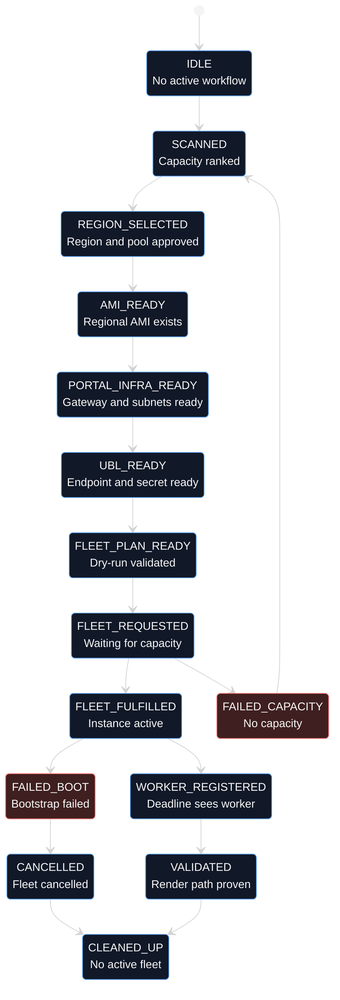

# GPU Capacity Scout and AWS Portal Fleet Launcher
This page describes a proposed tool workflow for choosing a viable AWS region, Availability Zone set, and GPU instance pool before spending time and money creating or reconfiguring Deadline AWS Portal infrastructure. It also outlines an optional API-driven fleet launcher that can reuse AWS Portal-created resources when the Portal UI is too limited.
## Problem statement
Deadline AWS Portal can start infrastructure and submit Spot Fleets, but it gives limited feedback when GPU capacity is unavailable. The Portal UI may show vague errors such as instance types not being available for the selected AMI operating system, while the underlying EC2 error is actually `InsufficientInstanceCapacity`.
This creates a slow loop:
1. Start Portal infrastructure in a region.
2. Create the UBL endpoint.
3. Try `Start Spot Fleet`.
4. Wait for Portal or Spot Fleet feedback.
5. Discover there is no current Spot capacity.
6. Tear down or move to another region.
The tool should move the capacity decision to the front of the workflow.
## Goals
The first version should be a read-only advisor:
- Rank candidate regions for Houdini/Karma GPU workers.
- Rank candidate instance families and sizes.
- Identify likely Spot capacity before Portal infrastructure is created.
- Identify whether an AMI already exists in a candidate region or must be copied.
- Explain whether the next step should be same-region retry, regional Portal rebuild, or On-Demand validation.
A later version may perform controlled launch operations:
- Reuse active AWS Portal infrastructure.
- Create or reuse the regional UBL endpoint.
- Submit a Spot Fleet or EC2 Fleet through AWS APIs using Portal subnets, security groups, IAM roles, tags, and worker user data.
- Monitor fulfillment and worker registration.
- Cancel or clean up failed attempts.
## Non-goals
The scout should not guarantee capacity. Spot availability is volatile, and AWS placement scores are probabilistic. The tool should provide better evidence than the Portal UI, not a promise.
The first version should not create infrastructure or launch instances. Mutating operations should be separate commands with explicit `--yes` behavior.
## Tool split
Use separate tools so read-only scouting stays safe and cheap.
### `scan_gpu_capacity`
Read-only. Runs before Portal infrastructure exists in a new region.
Inputs:
- Candidate regions, for example `us-west-2`, `us-east-1`, `us-east-2`.
- Candidate families, for example `g6`, `g6e`, `g5`.
- Candidate sizes, for example `g6.2xlarge`, `g6.4xlarge`, `g6.8xlarge`, `g6.16xlarge`, `g6.24xlarge`.
- Target capacity, usually `1` for validation.
- Preferred operating system/product description, usually `Linux/UNIX`.
- Current source AMI ID and source region.
Outputs:
- Ranked region/AZ score table.
- Recommended instance pool.
- Spot price history summary.
- On-Demand price summary when Price List data is available.
- AMI availability/missing-copy status per region.
- Quota warnings.
- Recommended next action.
### `prepare_portal_region`
Mostly read-only, with optional apply mode for AMI copy and UBL setup. Runs after a target region has been selected.
Checks:
- AMI exists in the target region.
- Portal infrastructure exists and is `CREATE_COMPLETE`.
- Gateway is running.
- Worker private subnets exist.
- `ReverseSlaveSG` exists.
- Deadline Cloud UBL endpoint exists in the Portal VPC.
- Secrets Manager secret `houdini/license-endpoint-dns` points to the regional endpoint.
### `launch_portal_worker_fleet`
Mutating. Optional advanced workflow when the Portal UI cannot represent the desired instance pool or fails because of stale pricing/catalog validation.
This tool should require `--yes` and should print the exact launch plan before submitting anything.
Launch inputs:
- Region.
- Portal stack name or auto-discovery.
- AMI ID.
- Instance pool.
- Target capacity.
- Spot or On-Demand mode.
- Maximum price policy if using Spot.
- Deadline pool/group settings.
- Auto-shutdown or maintain-capacity behavior.
Launch resources discovered from Portal:
- Worker IAM instance profile `AWSPortalWorkerRole`.
- Spot Fleet IAM role `DeadlineSpotFleetRole`.
- Worker security group `ReverseSlaveSG`.
- Portal private subnets from child stacks.
- Portal client bucket and Gateway certificate path.
- Portal stack tags and `DeadlineTrackedAWSResource` tag value.
### `watch_worker_fleet`
Read-only by default, with optional cancel mode.
Monitors:
- Spot Fleet request state and activity.
- Spot Fleet history records.
- Active Spot Fleet instances.
- EC2 worker instance state.
- Cloud-init or CloudWatch boot logs when available.
- UBL endpoint status.
- Deadline Worker registration.
- ZeroTier/DCV readiness if available.
## AWS APIs for the scout
Use these APIs before creating new Portal infrastructure.
### Spot placement scores
`ec2 get-spot-placement-scores` is the best first-pass signal for Spot likelihood.
Use a mixed pool instead of one instance type at a time. A single type can score poorly even when a broader family pool is viable.
Recommended call shape:
```bash
aws ec2 get-spot-placement-scores \
  --region us-west-2 \
  --region-names us-west-2 us-east-1 us-east-2 \
  --instance-types g6.2xlarge g6.4xlarge g6.8xlarge g6.16xlarge g6.24xlarge \
  --target-capacity 1 \
  --single-availability-zone
```
Interpretation:
- `8-10`: strong candidate.
- `5-7`: usable but not guaranteed.
- `1-4`: weak; expect failures or retries.
### Instance type offerings
`ec2 describe-instance-type-offerings` tells whether a type is offered in a region or AZ. This is not the same as live capacity.
Use it to avoid choosing a type that is not offered in the selected region/AZ.
### Spot price history
`ec2 describe-spot-price-history` confirms that pricing exists for a product description such as `Linux/UNIX`.
Price existence does not guarantee capacity. A Portal UI `$0.00` value usually means Portal failed to map a valid price/OS row; it does not mean the instance is free.
### AMI metadata
`ec2 describe-images` should be used to check:
- Architecture, for example `x86_64`.
- Platform details, for example `Linux/UNIX`.
- Usage operation.
- Boot mode.
- Virtualization type.
- Root device type.
- Product codes or billing products.
The current Houdini worker AMI in `us-west-2` has been validated as `x86_64`, `Linux/UNIX`, EBS-backed, HVM, and compatible with `g6` from EC2's perspective.
### Dry-run launch validation
After Portal infrastructure exists in a region, use `ec2 run-instances --dry-run` against a Portal private subnet and `ReverseSlaveSG`.
A `DryRunOperation` response means the AMI, instance type, subnet, security group, and IAM profile are compatible and the request would have succeeded if not dry-run. It does not guarantee Spot capacity.
### Service quotas
Use `service-quotas` to check GPU quota families. Capacity can look good but still fail if the account lacks regional quota.
Quota categories to check include:
- Running On-Demand G and VT instances.
- All G and VT Spot Instance Requests.
- Regional EC2 Spot request limits if exposed in the account.
## Houdini GPU family guidance
For Houdini/Karma validation, prefer a mixed `g6` pool first.
Recommended first validation pool:
- `g6.2xlarge`
- `g6.4xlarge`
- `g6.8xlarge`
- `g6.16xlarge`
- `g6.24xlarge`
Use all viable Portal AZs. Target capacity should be `1` until the worker boot, Deadline registration, UBL licensing, and render validation path are proven.
Family guidance:
- `g6`: best current default for Houdini/Karma Spot validation; NVIDIA L4 GPU, good availability relative to other GPU families.
- `g6e`: better for large GPU scenes because it uses L40S-class GPUs with more VRAM, but Spot availability can be weaker.
- `g5`: older A10G fallback; current availability may be poor in some regions.
- CPU-only families such as `c7i`, `m7i`, or `r7i`: better for CPU sims or CPU rendering, not Karma XPU validation.
## Region selection workflow
Use this workflow before creating a new regional Portal stack.
1. Run `scan_gpu_capacity` across candidate regions.
2. Select the region with the best mixed-pool score and acceptable pricing.
3. Check whether the worker AMI exists in that region.
4. If missing, copy the AMI to the selected region.
5. Start AWS Portal infrastructure in that region.
6. Run `prepare_portal_region --yes` to create the regional UBL endpoint.
7. Use AWS Portal `Start Spot Fleet` if the UI accepts the desired pool.
8. If the UI fails but EC2 dry-run validates, use `launch_portal_worker_fleet --yes` as the advanced path.
9. Run `watch_worker_fleet` until a worker registers or capacity failure is clear.
## API-driven fleet launch feasibility
AWS Portal's Monitor UI ultimately creates a standard EC2 Spot Fleet request. The current observed Portal fleet used:
- `DeadlineSpotFleetRole` as the fleet role.
- `AWSPortalWorkerRole` as the worker instance profile.
- The custom Houdini worker AMI.
- Portal child-stack private subnets.
- `ReverseSlaveSG`.
- Portal-generated user data.
- Tags including `DeadlineRole=DeadlineRenderNode` and `DeadlineTrackedAWSResource=AWSPortal - <stack>`.
This means an API launcher is feasible. However, it may not be fully managed by the AWS Portal UI unless the tags and metadata match what Portal expects. Treat API-created fleets as project-managed resources even if they reuse Portal infrastructure.
Prefer `create-fleet` for newer implementations if it supports the required behavior cleanly. Use `request-spot-fleet` only if it better matches AWS Portal's existing request shape.
## AWS Portal UI visibility
When a fleet is started from Deadline Monitor AWS Portal, the AWS Portal UI should know about the fleet immediately because the Portal plugin submitted it. The operator should expect to see the request represented in the Portal UI once the request is accepted, even if no worker instances have launched yet.
When a fleet is created by an external script or MCP tool through EC2 APIs, do not assume it will appear as a fully manageable AWS Portal UI entry. It may appear indirectly through tagged AWS resources or Deadline Worker registration, but the Portal UI may not expose the same controls it uses for fleets it submitted itself.
The MCP tool should therefore treat API-created fleets as project-managed resources. It must keep its own state record and cleanup path, even when the fleet uses Portal subnets, Portal security groups, Portal IAM roles, Portal tags, and Portal-generated worker behavior.
## Idempotent MCP state-machine design
The workflow should be implemented as an idempotent state machine, not a one-shot script. Every MCP tool call should begin by observing AWS and repository state, reconciling that with the saved workflow state, and then deciding whether any action is needed. Re-running the same command should be safe.
Use GitLab as the first shared persistence and operator UI. The quickest useful model is one GitLab issue per workflow attempt, with GitLab development boards grouped by scoped FSM labels. This gives operators a visible board while the MCP tool keeps a machine-readable state payload in the issue description.
GitLab persistence model:
- Create one issue per workflow attempt, for example `fleet/us-west-2/g6/2026-05-29T21-30Z`.
- Use a scoped label for the current FSM state, for example `fsm::FLEET_REQUESTED`. Only one `fsm::*` label should be present at a time.
- Use additional labels for classification, for example `region::us-west-2`, `family::g6`, `mode::spot`, `workflow::gpu-capacity`, and `owner::mcp`.
- Configure a GitLab development board with columns for the scoped `fsm::*` labels. This board becomes the quick UI for operators.
- Keep the issue description as the current desired/observed state, including a fenced machine-readable JSON block between stable markers.
- Use issue comments as the append-only event log for transitions, AWS errors, capacity failures, approvals, and cleanup notes.
- Keep issue tasks or a markdown resource inventory for opened resources so operators can see active fleet requests and instances without reading JSON.
The state payload should contain:
- Workflow ID and project name.
- GitLab project ID and issue IID.
- Current FSM state label and previous state label.
- Region and selected AZ IDs.
- Source AMI and regional AMI ID.
- Portal stack name, VPC ID, Gateway instance ID, worker subnet IDs, and `ReverseSlaveSG`.
- UBL endpoint ID, endpoint DNS, and Secrets Manager secret version.
- Fleet request ID, launch method, target capacity, instance pool, and tags.
- Opened instance list with instance ID, type, AZ/subnet, private IP, state, launch time, and Deadline Worker name when known.
- Opened Spot Instance Request IDs and last status code/message.
- Last observed status, last error, and last AWS event timestamp.
- Operator-approved transitions, especially for mutating steps.
Other storage options can be added later. A local JSON state file is useful for development, an S3 object is useful for shared non-GitLab automation, and DynamoDB is appropriate if concurrent operators or locks become necessary. GitLab should remain the human-facing view even if another backend becomes the locking/source-of-truth store.
Idempotency rules:
- `scan_gpu_capacity` never mutates AWS. It may create or update the GitLab workflow issue with scan results.
- `prepare_portal_region` reuses existing AMIs, Portal stacks, UBL endpoints, security-group rules, and secrets when they already match the desired state.
- `launch_portal_worker_fleet` must first search GitLab state and AWS for an existing active fleet tied to the workflow. It must refuse to create a second active fleet unless explicitly told to replace or scale.
- `watch_worker_fleet` only observes by default. It refreshes the GitLab issue state, board label, resource inventory, and event notes. Cancel or cleanup actions require explicit approval.
- GitLab label updates must be transactional from the user's perspective: remove the old `fsm::*` label and add the new one in the same transition routine.
- Cleanup steps should be safe to retry and should tolerate already-deleted resources.
Troubleshooting requirements:
- Every state transition should include the exact AWS IDs discovered or created.
- Fleet history and capacity errors should be copied into the state record and into a GitLab issue comment.
- The opened resource inventory should list every active fleet, Spot request, EC2 instance, UBL endpoint, Gateway, and regional AMI relevant to the workflow.
- The tool should expose `status`, `events`, `explain`, `retry`, `cancel`, and `cleanup` operations.
- The tool should print the next safe action after every run and update the GitLab issue description with that next action.
Recommended states:
- `IDLE`: no active workflow.
- `SCANNED`: capacity scan completed and candidate regions ranked.
- `REGION_SELECTED`: operator selected target region and instance pool.
- `AMI_READY`: regional AMI exists and matches the source AMI intent.
- `PORTAL_INFRA_READY`: AWS Portal infrastructure exists and Gateway is running.
- `UBL_READY`: UBL endpoint is `READY` in the Portal VPC and secret is current.
- `FLEET_PLAN_READY`: launch plan has been built and validated by dry-run checks where possible.
- `FLEET_REQUESTED`: fleet request exists but has not fulfilled target capacity.
- `FLEET_FULFILLED`: target capacity has at least one active instance.
- `WORKER_REGISTERED`: Deadline Worker is visible and reachable.
- `VALIDATED`: render/licensing validation succeeded.
- `FAILED_CAPACITY`: AWS reported capacity failure or repeated launch spec blacklist.
- `FAILED_BOOT`: EC2 launched but worker bootstrap or registration failed.
- `CANCELLED`: fleet was intentionally cancelled.
- `CLEANED_UP`: no active project-managed worker fleet remains.

## GitLab issue template
Each workflow issue should keep a human-readable summary at the top and a machine-readable state block below it. The MCP tool should update only the marked state block and resource inventory sections so operator notes remain intact.
Example issue sections:
- Current state and next safe action.
- Desired region, instance pool, target capacity, and launch mode.
- Opened resource inventory.
- Capacity scan summary.
- Machine state block between `<!-- mcp-state:start -->` and `<!-- mcp-state:end -->`.
- Operator notes.
Example machine state shape:
```json
{
  "workflow_id": "fleet-us-west-2-g6-20260529T213000Z",
  "fsm_state": "FLEET_REQUESTED",
  "gitlab": {
    "project_id": "94",
    "issue_iid": "46",
    "state_label": "fsm::FLEET_REQUESTED"
  },
  "region": "us-west-2",
  "instance_pool": ["g6.4xlarge", "g6.8xlarge", "g6.16xlarge"],
  "target_capacity": 1,
  "portal": {
    "stack_name": "stackc368e57c7b2642e78637998567d33aa6",
    "vpc_id": "vpc-0e131d1e1998510e9",
    "worker_security_group_id": "sg-0c5c1526c63a93359",
    "worker_subnet_ids": ["subnet-015ef0f98d73426b0"]
  },
  "ubl": {
    "license_endpoint_id": "le-299800e08ec74ac6a181ae58e8cad525",
    "status": "READY"
  },
  "fleet": {
    "request_id": "sfr-example",
    "launch_method": "portal-ui",
    "fulfilled_capacity": 0
  },
  "opened_instances": [],
  "last_error": "InsufficientInstanceCapacity",
  "next_action": "Wait for retry or cancel and rescan region pool"
}
```
## Safety rules for mutating tools
Mutating tools must:
- Default to dry-run.
- Require `--yes` to apply.
- Print discovered Portal stack, VPC, subnets, security groups, IAM roles, AMI, instance pool, and target capacity before launch.
- Refuse to launch if the UBL endpoint is missing or points to a different VPC.
- Refuse to launch if the active Portal stack is not `CREATE_COMPLETE`.
- Tag every launched resource with the Portal stack and project tags.
- Record the fleet request ID for cleanup.
- Provide a cancel command.
## Cleanup expectations
Failed or unfulfilled fleets should be cancelled so they do not unexpectedly fulfill later.
Cleanup should verify:
- No active Spot Fleet requests unless intentionally running.
- No Portal worker EC2 instances unless intentionally running.
- No orphan Spot Instance Requests.
- UBL endpoint belongs to the active Portal VPC.
- Stopped/deleted regional Portal infrastructure has no stale EIPs, VPC endpoints, Gateway, NAT Gateway, or stale UBL endpoint.
## Suggested command UX
Example read-only scout:
```bash
./aws/gpu_capacity_scout.sh \
  --regions us-west-2,us-east-1,us-east-2 \
  --families g6,g6e,g5 \
  --target-capacity 1 \
  --source-ami ami-0f70342f66dc80ddb \
  --source-region us-west-2
```
Example regional preparation dry-run:
```bash
./aws/prepare_portal_region.sh \
  --region us-east-1 \
  --ami-name deadline-10.4.2.3-houdini-21.0-ubuntu22-l40s-v1 \
  --dry-run
```
Example API launch dry-run:
```bash
./aws/launch_portal_worker_fleet.sh \
  --region us-east-1 \
  --target-capacity 1 \
  --instance-types g6.2xlarge,g6.4xlarge,g6.8xlarge,g6.16xlarge \
  --dry-run
```
## Sequence diagram

```mermaid
%%{init: {"theme": "dark", "themeVariables": {"background": "#0b1020", "mainBkg": "#111827", "primaryColor": "#1f2937", "primaryBorderColor": "#60a5fa", "primaryTextColor": "#f9fafb", "actorBkg": "#1f2937", "actorBorder": "#60a5fa", "actorTextColor": "#f9fafb", "activationBkgColor": "#374151", "activationBorderColor": "#93c5fd", "noteBkgColor": "#111827", "noteTextColor": "#f9fafb", "noteBorderColor": "#4b5563", "signalTextColor": "#e5e7eb", "sequenceNumberColor": "#facc15"}}}%%
sequenceDiagram
    autonumber
    actor OP as "Operator<br/>Deadline Monitor"
    participant SCOUT as "scan_gpu_capacity<br/>Read-only advisor"
    participant AWS as "AWS EC2 APIs<br/>Scores Prices Offerings"
    participant PORTAL as "AWS Portal<br/>Infrastructure"
    participant PREP as "prepare_portal_region<br/>AMI UBL checks"
    participant LAUNCH as "launch_portal_worker_fleet<br/>Optional API launcher"
    participant FLEET as "EC2 Spot Fleet<br/>Worker capacity"
    participant WORKER as "Deadline Worker<br/>Houdini Karma"

    rect rgb(17, 24, 39)
        OP->>SCOUT: "Request region and GPU pool ranking"
        SCOUT->>AWS: "Get Spot placement scores price history offerings quotas and AMI metadata"
        AWS-->>SCOUT: "Return ranked candidate regions AZs and instance pools"
        SCOUT-->>OP: "Recommend region pool and next action"
    end

    rect rgb(31, 41, 55)
        OP->>PORTAL: "Start regional Portal infrastructure if needed"
        OP->>PREP: "Validate AMI Portal stack Gateway subnets SG and UBL endpoint"
        PREP-->>OP: "Region ready or missing prerequisites"
    end

    rect rgb(17, 24, 39)
        OP->>PORTAL: "Try Start Spot Fleet through UI"
        PORTAL->>FLEET: "Submit Portal-managed Spot Fleet"
        FLEET-->>PORTAL: "Fulfilled or capacity error"
    end

    rect rgb(63, 31, 31)
        OP->>LAUNCH: "If Portal UI cannot launch desired pool use API dry-run then --yes"
        LAUNCH->>FLEET: "Submit project-managed fleet using Portal resources"
        FLEET->>WORKER: "Launch worker when capacity exists"
        WORKER-->>OP: "Registers in Deadline and uses UBL endpoint"
    end
```

## Implementation priority
Build `scan_gpu_capacity` first. It is read-only, low-risk, and immediately improves regional decisions.
Then add `prepare_portal_region` checks around the existing UBL helper.
Only implement `launch_portal_worker_fleet` after the scout and preparation checks are reliable, because it creates billable resources and may not be fully visible to the AWS Portal UI.
